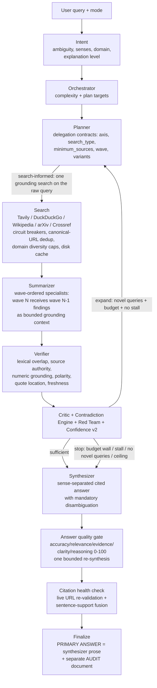

# Architecture

How the v2 system fits together — components, data flow, and the reasoning
behind the design decisions that differ from a standard RAG chatbot.

---

## Pipeline



One LangGraph instance drives the loop (`app/graph/workflow.py`); the
resume endpoint re-enters at the critic node with state rebuilt from SQLite.

---

## Synthesis: structured internally, adaptive externally

The pipeline determines **what is known**; the synthesis layer determines
**what matters for this question**; the presentation layer determines **how to
communicate it**. These three responsibilities are deliberately separate.

```text
evidence state ──> ADAPTIVE ANSWER BLUEPRINT ──> synthesis ──> primary answer
                        (question + evidence)                 (clean, cited)
                                                                     +
                                                              audit / trace
```

* **Evidence state** is the verified fact pool, contradictions, independence and
  temporal profile — produced by the research pipeline and unchanged by
  synthesis.
* **Adaptive answer blueprint** (`app/agents/outline.py`, `AnswerBlueprint`) is
  a deterministic, LLM-free plan for HOW to communicate: the presentation
  strategy for the question family (comparison by criterion, mechanism chain,
  ordered steps, options + trade-offs, thematic synthesis, concise definition),
  the dominant themes the evidence supports, and the depth. It names no
  headings.
* **Primary answer** is the synthesizer's prose. For every profile except
  `audit` it is returned verbatim, with no injected report skeleton. The only
  machine-appended tail is the numbered source legend (citations stay visible).
* **Audit / trace** (`build_answer_audit`, the `final_audit` field) holds
  research provenance: confidence and its caveats, the measured five-axis
  quality score, the supporting-evidence ledger, source conflicts, the decision
  layer, and measured evidence accounting. None of it is mixed into the answer.

**Modes scale effort, not format.** Quick/standard/deep/audit differ in research
breadth, triangulation and synthesis depth (and the `audit` profile additionally
uses a fixed, traceable format). They do not switch between unrelated fixed
report templates.

**Audit is the one fixed format.** Because an audit is a format, the `audit`
profile keeps the explicit section contract; every other profile lets structure
emerge from the question and the evidence.

---

## Component map

### Intelligence

| Module | Responsibility |
|---|---|
| `app/agents/intent.py` | Intent classification before research: ambiguity → ranked senses, domain, explanation level; deterministic fallback with curated homonym hints; never blocks — the answer disambiguates. |
| `app/agents/answer_quality.py` | Pre-delivery gate: five-axis 0-100 scoring from measured state; scores usefulness (relevance/coherence/signal density/citation integrity), never heading compliance; penalizes process leakage; one bounded re-synthesis with failures fed back. |
| `app/agents/outline.py` | Answer-first outline + adaptive `AnswerBlueprint`: the deterministic presentation strategy (question family, dominant themes, depth) handed to the writer in place of a heading list. |
| `app/agents/planner.py` | Contracts with axis/search_type/minimum_sources/variants/wave/sense; axis-coverage enforcement; intent domain override; dependency waves (max 3). |
| `app/agents/search.py` | 5 providers, per-provider circuit breakers + retry policies, fetch bulkhead, PDF extraction, canonical-URL + near-dup snippet dedup, domain diversity caps, freshness half-lives, disk cache. |
| `app/agents/summarizer.py` | Per-contract specialists (financial/technical/…), source attribution validated against provided documents, direct-quote parsing, token-budgeted chunking, per-URL cache keyed by role + prerequisite digest. |
| `app/agents/verifier.py` | Deterministic per-fact checks; blanks raw content after each pass (memory hygiene). |
| `app/core/contradictions.py` | Three detectors (polarity first — outside the similarity band; then temporal; then unit-aware numeric), severity ordering, cap 5. |
| `app/core/confidence.py` | 7 base signals + citation support + axis coverage + pool-size-scaled contradiction penalty; degraded-run cap 0.55. |
| `app/agents/citation_check.py` | Live URL re-validation (HEAD → 2KB ranged GET, bounded, never fatal) fused with sentence support into per-source verdicts (ok/warn/broken/bad). |
| `app/core/semantic.py` | TF-IDF hybrid engine: stemming, synonym canonicalization, negation weighting, vectorized batch scoring, stopword-stripped dup floor. |
| `app/agents/redteam.py` | Heuristic adversarial review; survival score gates the critic. |
| `app/core/decision.py` | Decision layer (options → recommendation → rationale → risk) for strategic queries. |

### Control & efficiency

| Module | Responsibility |
|---|---|
| `app/core/depth_controller.py` | Intelligent stopping: sufficiency, marginal-gain stalls, ceiling, no-novel-query memory, budget walls, mode confidence targets, min iterations. |
| `app/core/usage.py` | Per-run ledger (ContextVar): LLM tokens/cost, searches, cache hits; feeds the budget governor, the stopping rule, the API events and the UI. |
| `app/agents/budget.py` | Four ceilings (USD/tokens/calls/seconds), mode multipliers, can-afford-pass protocol. |
| `app/core/llm.py` | Provider chain with breakers, fail-fast auth/quota errors, Retry-After honoring (capped 3s), JSON mode, usage parsing, probe caching (30s success). |
| `app/core/llm_cache.py` | Exact-prompt disk cache (TTL 6h, size-capped) — cache hits refund USD while keeping token accounting. |
| `app/core/isolation.py` | AgentContext per sub-question: workers never see the full state or another contract's raw content. |

### Surfaces

| Module | Responsibility |
|---|---|
| `app/api/routes.py` | NDJSON stream (events below), resume, trace, provider CRUD + latency probe. |
| `app/db/sqlite.py` | 14 tables, WAL, auto-initialized schema, `file:`/`sqlite://` URL forms. |
| `frontend/` | React mission console: thread, answer card, claim drawer, intelligence panel (budget meter, wave strip, citation health, confidence breakdown). |

---

## NDJSON event schema (`POST /api/research/stream`)

| Event | Payload highlights |
|---|---|
| `progress` | `request_id`, `message` |
| `plan` | `items` (sub-questions), `orchestration`, `waves` (dependency-wave shape) |
| `search_progress` | `snippets` |
| `critic` | `iteration`, `reason`, `breakdown` (confidence signals + weights + notes), `redteam`, `budget` (live ledger snapshot) |
| `findings` | `items` (claims with verification flags/scores/reasons); re-emitted once with `verified_update` after the verifier pass |
| `final_report` | `report` (the primary answer), `audit` (separate audit/trace markdown), `confidence`, `degraded`, `answer_support`, `budget`, `wave_report`, `citation_health`, `quality`, `outline` |
| `decisions` | `items` (decision layer options) |
| `error` | `message` (actionable: key/quota/timeout causes) |

---

## Design decisions worth knowing

**Why verification is deterministic (no LLM).** A verifier that costs a
model call is a verifier you consult less often. Lexical + numeric +
polarity checks run in ~145µs per claim and catch the failure modes that
matter (fabricated numbers, negation inversions, topical mismatches) —
measured F1 1.0 on the labeled set.

**Why the LLM cache is exact-prompt.** Semantic caching returns subtly
wrong answers to slightly different questions. Research pipelines re-issue
*identical* prompts (critic re-evals after partial expansion, re-runs) —
an exact-hit cache captures that traffic with zero correctness risk.

**Why contradictions penalize instead of blending into the average.**
A weighted average lets three strong sources mask one direct lie. The
penalty is pool-size scaled: one conflict among 3 facts means a third of
the evidence disagrees; among 30 it is one stale page.

**Why "not" is not a stopword.** The negation token weighted like a number
is what keeps "X" and "not X" from merging in dedup, keeps them inside the
contradiction band, and keeps citation support from counting a negation as
an affirmation. (Found by the benchmark suite, not by intuition.)

**Why waves exist even though search is question-level.** The value is
context chaining in the summarizer: "compare X vs Y" runs after "what is X"
and receives its findings as bounded grounding — dependent extraction sees
references it could not resolve from raw pages alone.

**Why MAX_PARALLEL_LLM=2.** Concurrent large prompts are exactly what
exhausts free-tier TPM/TPD quotas (observed live: Groq 200k daily tokens
burned by 3 parallel summarizer calls). The semaphore bounds in-flight
prompts, not threads.

**Why the quality gate scores usefulness, not headings.** An earlier gate gave
25% of its clarity score for the presence of a `## Executive Summary` heading
and 25% for bullets. That actively drove the writer toward the same
report-shaped answer for every question and made a differently-shaped answer
fail its own review. Clarity now measures readability, length band, signal
density and the absence of process noise. A heading is never rewarded by
itself.

**Why process mechanics never reach the primary answer.** "Pipeline stage",
"deterministic fallback", evidence grades, budgets and confidence floats
describe the research system, not the subject. They are scrubbed from the
answer and rendered in the audit layer. Uncertainty is expressed in prose
("the evidence is thin on X"), not as a score.

**Why deep mode is depth, not length.** Deep/executive runs raise research
breadth, triangulation and the synthesis depth guidance; they do not select a
longer fixed report structure. A deep answer is stronger, not merely longer.

---

## Data lifecycles

- **Raw page content** is blanked by the verifier after each pass — the
  last consumer of full text is verification; snippets persist for
  transparency.
- **Facts** accumulate across passes with append-only plan growth; dedup
  merges restatements and records corroboration (distinct domains only —
  self-syndication is not corroboration).
- **Caches**: search results 1h, LLM responses 6h, both size-capped at
  250MB and LRU-evicted.
- **SQLite**: every run persists agent events, sources, claims,
  verification results, contradictions, citations, critic reviews and
  decisions — the trace endpoint reconstructs the full timeline.
