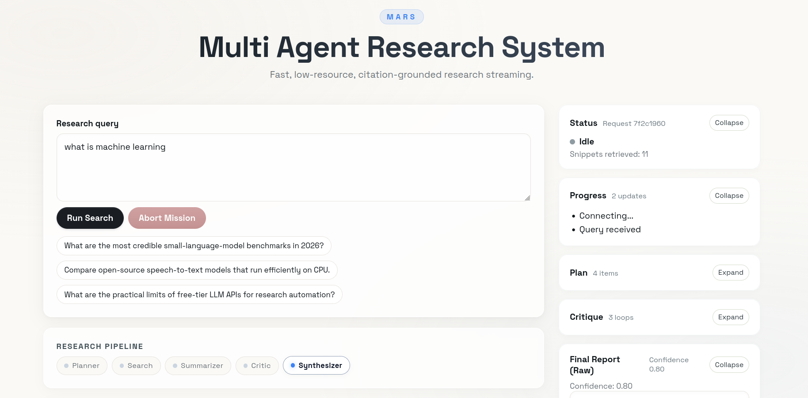

<div align="center">


# MARS — Multi-Agent Research System

</div>

A lightweight, asynchronous research pipeline that plans, searches, summarizes, critiques, and delivers structured markdown reports — powered by remote LLM APIs with no local model serving required.


Key capabilities:

- **Autonomous planning** — decomposes queries into targeted sub-questions
- **Parallel search** — bounded async retrieval with provider fallback
- **Iterative refinement** — critic agent loops until research is sufficient or iteration ceiling is reached
- **Streaming output** — real-time NDJSON events for live frontend updates
- **Zero heavy infrastructure** — no Redis, no message queue, no local model serving

---

## Architecture

MARS orchestrates a five-stage pipeline via **LangGraph**:

```
Query → Planner → Search → Summarizer → Critic → (loop or Finalize)
```

| Agent | Module | Responsibility |
|---|---|---|
| Planner | `app/agents/planner.py` | Generates focused sub-questions from the original query |
| Search | `app/agents/search.py` | Executes bounded async searches with provider fallback |
| Summarizer | `app/agents/summarizer.py` | Extracts structured facts from raw search snippets |
| Critic | `app/agents/critic.py` | Evaluates research sufficiency; triggers refinement or finalization |
| Workflow | `app/graph/workflow.py` | Defines graph transitions and loop routing logic |

Supporting components:

- **`app/api/routes.py`** — FastAPI endpoints including the streaming research route
- **`app/db/sqlite.py`** — SQLite initialization and report persistence
- **`app/core/`** — Configuration, logging, and shared utilities

---

## Technology Stack

| Layer | Technology |
|---|---|
| Backend framework | FastAPI |
| Agent orchestration | LangGraph |
| HTTP client | httpx (async) |
| Database | aiosqlite / SQLite |
| Data validation | Pydantic |
| Frontend | React 18 + Vite 5 |

---

## Project Structure

```
mars/
├── main.py                   # Application entrypoint
├── requirements.txt
├── .env.example
├── app/
│   ├── agents/
│   │   ├── planner.py
│   │   ├── search.py
│   │   ├── summarizer.py
│   │   └── critic.py
│   ├── api/
│   │   └── routes.py
│   ├── core/
│   ├── db/
│   │   └── sqlite.py
│   └── graph/
│       └── workflow.py
└── ui/
    └── src/
```

---

## Prerequisites

| Requirement | Minimum Version |
|---|---|
| Python | 3.10+ |
| Node.js | 18+ |
| npm | 9+ |

> **LLM Provider:** At least one of `GROQ_API_KEY` or `HUGGINGFACE_API_KEY` must be configured.

---

## Getting Started

### 1. Clone the repository

```bash
git clone <repository-url>
cd mars
```

### 2. Set up the backend

```bash
python3 -m venv .venv
source .venv/bin/activate        # On Windows: .venv\Scripts\activate
pip install -r requirements.txt
cp .env.example .env
```

### 3. Configure environment variables

Open `.env` and set at least one LLM provider key:

```env
# Primary LLM (recommended)
GROQ_API_KEY=your_groq_key_here

# Fallback LLM
HUGGINGFACE_API_KEY=your_hf_key_here

# Optional: richer search results
TAVILY_API_KEY=your_tavily_key_here
```

See the full [Configuration Reference](#configuration-reference) below.

### 4. Start the backend server

```bash
uvicorn main:app --host 127.0.0.1 --port 8000 --reload
```

### 5. Start the frontend

```bash
cd ui
npm install
npm run dev
```

The application will be available at **http://127.0.0.1:5173**.

---

## Configuration Reference

| Variable | Required | Default | Description |
|---|---|---|---|
| `GROQ_API_KEY` | Conditional* | `""` | Primary LLM provider API key |
| `GROQ_MODEL` | No | `llama-3.1-8b-instant` | Groq model identifier |
| `HUGGINGFACE_API_KEY` | Conditional* | `""` | Fallback LLM provider API key |
| `HUGGINGFACE_MODEL` | No | `Qwen/Qwen2.5-7B-Instruct` | HuggingFace model identifier |
| `TAVILY_API_KEY` | No | `""` | Optional enriched search provider |
| `DATABASE_URL` | No | `./research.db` | SQLite database file path |
| `MAX_PARALLEL_SEARCH` | No | `2` | Maximum concurrent search operations |
| `MAX_ITERATIONS` | No | `3` | Maximum planner–search–summarize–critic loop cycles |
| `LLM_TIMEOUT_SEC` | No | `25` | Per-request LLM timeout (seconds) |
| `SEARCH_TIMEOUT_SEC` | No | `20` | Per-request search timeout (seconds) |

> \* At least one of `GROQ_API_KEY` or `HUGGINGFACE_API_KEY` must be provided.

---

## API Reference

### `GET /`

Returns service metadata and a list of available endpoints.

---

### `GET /api/health`

Health check endpoint.

**Response**

```json
{ "status": "ok" }
```

---

### `POST /api/research/stream`

Executes the full research pipeline and streams progress as newline-delimited JSON (`application/x-ndjson`).

**Request body**

```json
{
  "query": "What are the latest open-source small language model benchmarks in 2026?"
}
```

**Validation**

- `query` must be between **5 and 500 characters**.

**Event schema**

| Event type | Payload |
|---|---|
| `progress` | `{ "type": "progress", "request_id": "...", "message": "..." }` |
| `plan` | `{ "type": "plan", "items": ["..."] }` |
| `search_progress` | `{ "type": "search_progress", "snippets": 12 }` |
| `critic` | `{ "type": "critic", "iteration": 1, "reason": "..." }` |
| `findings` | `{ "type": "findings", "items": [{ "claim": "...", "source": "..." }] }` |
| `final_report` | `{ "type": "final_report", "report": "...", "confidence": 0.73 }` |
| `error` | `{ "type": "error", "message": "..." }` |

**Example**

```bash
curl -N -X POST http://127.0.0.1:8000/api/research/stream \
  -H "Content-Type: application/json" \
  -d '{"query": "Compare efficient open-source speech-to-text models for CPU inference"}'
```

---

## Data Persistence

Completed research reports are automatically persisted to a local SQLite database (`research.db` by default).

**Table:** `research_reports`

| Column | Type | Description |
|---|---|---|
| `query` | TEXT | The original research query |
| `report` | TEXT | Final markdown report content |
| `confidence` | REAL | Model-assigned confidence score (0.0–1.0) |
| `created_at` | TEXT | UTC timestamp in ISO-8601 format |

---

## Reliability & Resource Profile

MARS is designed to operate efficiently in constrained environments:

- **Async I/O** throughout the API, search, and workflow layers
- **Bounded concurrency** via `MAX_PARALLEL_SEARCH` to cap simultaneous search requests
- **Iteration ceiling** via `MAX_ITERATIONS` to prevent unbounded agent loops
- **Provider fallback** for graceful degradation when a primary LLM is unavailable
- **Minimal footprint** — no Redis, no external queue, no local model inference

---

## Security

- **Never commit real API keys** to source control
- Keep `.env` local — add it to `.gitignore`
- Rotate keys immediately if they are accidentally exposed
- In production, use a secrets manager rather than a flat `.env` file

---

## Development Notes

- The Vite dev server proxies `/api` requests to `http://127.0.0.1:8000` — configured in `ui/vite.config.js`
- CORS is enabled for `http://127.0.0.1:5173` and `http://localhost:5173`
- Backend hot-reload is enabled by default via `--reload` flag in the `uvicorn` start command

## Demo



